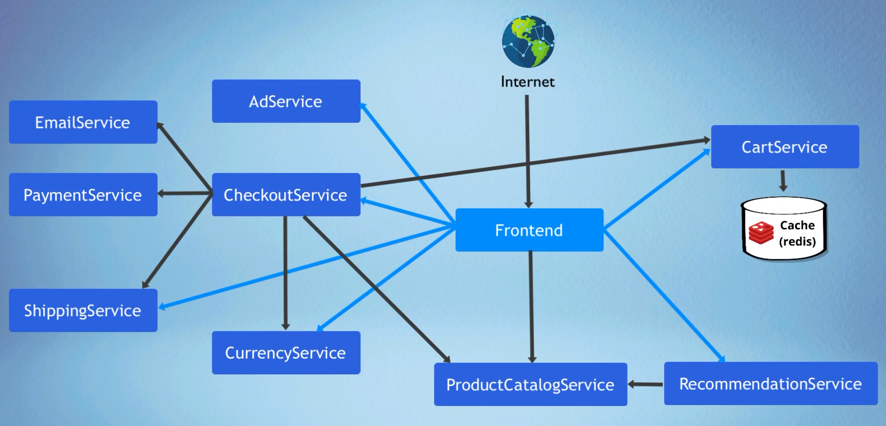
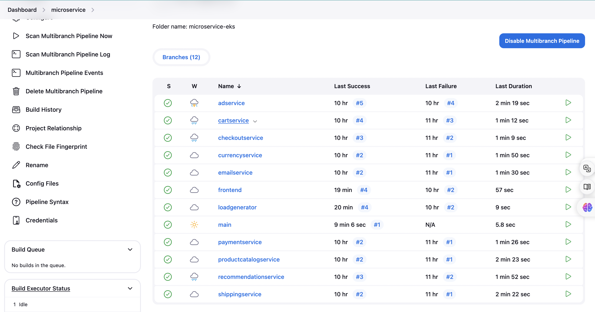

# 11 Microservices Deployment on AWS EKS

Boutique shop is a microservice application. This is a e-commerce app where users can explopre items, add to cart and purchase items.

This microservice application has been built using these technologies:

- NodeJS
- Java
- Python
- Golang
- C#
- PHP (Apache)
- Redis
- Nginx
- AngularJS (1.x)

## Archietecture

